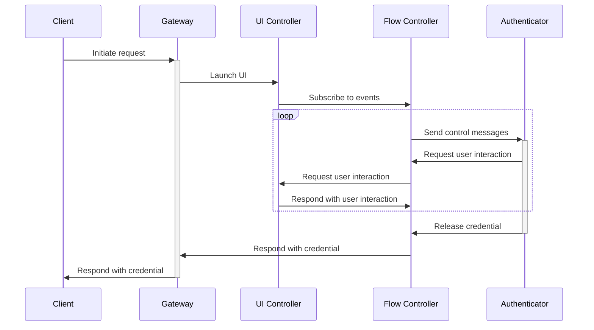

This document describes the high-level architecture of `credentialsd`. If you
want to familiarize yourself with the code base, you are just in the right
place!

# High-level Overview

There are three APIs defined in [doc/api.md](/doc/api.md). This repository contains
two services that implement the three APIs defined by the specification:

- `credentialsd`: Implements the Gateway API and Flow Control API
- `credentialsd-ui`: Implements the UI Control API.

These two services communicate with each other over D-Bus IPC.

The **Gateway** is the entrypoint for clients to interact with. The Flow
Controller and UI Controller work together to guide the user through the
process of selecting an appropriate credential based on the request received by
the Gateway.

The **UI Controller** is used to launch a UI for the user to respond to
authenticator requests for user interaction. The **Flow Controller** interacts
with the OS and hardware, like detecting available transports and
authenticators. It then relays the information needed for the UI to guide the
user through the authentication flow, like prompts for a user to enter their PIN
or touch the device. The UI Controller takes user input and responds back to the
Flow Controller.

The UI Controller and Flow Controller pass user interaction request and action
messages back and forth until the authenticator releases the credential. Then,
the Flow Controller sends the credential to the Gateway, which relays the
credential to the client.

Here is a diagram of the intended usage and interactions between the APIs.



The division into multiple services and APIs has two purposes:

- least privilege: if there is a vulnerability in the UI process, it shouldn't
  have access to interact with the credential service memory directly. Also,
  hosting separate D-Bus services allows us to set different access control
  policies on the bus, restricting communication on the Flow Control and UI
  Control APIs to the `credentialsd` and `credentialsd-ui` services.

- flexibility: UIs are very specific to their desktop environment, so it would
  be impossible to satisfy the style and requirements for all the various Linux
  desktop environments out there. This separation allows desktop environments to
  create their own UIs targeted for their users.

# Code Map

## credentialsd

A Rust binary project for the service hosting the Gateway and Flow Control APIs.
Interacts with authenticators and clients/user agents.

`credentialsd` does not start the UI directly; it sends a request to start the
UI via D-Bus. It relies on D-Bus service activation or some other external
method to start the process that hosts the UI Control API.

Credential requests on the Gateway are handled one at a time; if a new request
comes in, it is immediately rejected, and the client is expected to retry if
necessary. Currently, clients cannot cancel their own requests; the user has to
do that via the UI.

### `credentialsd/src/credential_service/`

`CredentialService` is the main component that interacts with authenticators. It
also holds request context to return back to the Gateway for request completion
or when the Flow Controller notifies it that the request is cancelled.

Various authenticator transports are handled in sub-modules, for now USB and
hybrid transports are supported. Each handler starts a `Stream` of events that
represents requests from the authenticator for user interaction. If a response
is required from the user, the event should contain a channel for the credential
service to send the response after it receives user input.

The credential service mostly just forwards events over to the UI service, minus
any details that are not necessary for the UI to know (like the response
channels mentioned above, which cannot be serialized over D-Bus anyway).

Actual interaction I/O is performed in the [libwebauthn][libwebauthn] library.

[libwebauthn]: https://github.com/linux-credentials/libwebauthn

### `credentialsd/src/dbus/`

D-Bus clients and services.

The Gateway and Flow Controller services are defined here, as well as a client
for the UI Controller.

The `model` module contains some methods to convert from D-Bus types to internal
credential service types. (These types don't need to be made known to the UI, so
they do not live in `credentialsd-common`).

### `credentialsd/src/webauthn.rs`

Types and functions needed to repackage requests from and responses to
JSON-strings according to the [WebAuthn spec](webauthn-3).

There is one notable deviation from the spec: since we use JSON strings for
requests and responses, raw binary fields need to be base64url-encoded strings.
(See the note on [D-Bus/JSON serialization][dbus-json-serialization] in the API
docs.) It is the responsibility of the application using this service to
de-/construct the field accordingly.

Re-exports many types from `libwebauthn`.

[webauthn-3]: https://www.w3.org/TR/webauthn-3
[dbus-json-serialization]: /doc/api.md#d-busjson-serialization

### `credentialsd/tests`

The `tests/` directory contains a setup for integration tests, allowing
`credentialsd` to connect to a test D-Bus instance. There is currently only a
few tests there; this should be expanded in the future.

## `credentialsd-common/`

Rust types shared between `credentialsd` and `credentials-ui`.

Most of the types live in `src/model.rs`, and some are duplicated in
`src/server.rs`. The duplicates in the `server` module have tweaks that make it
easier to serialize over D-Bus, but more difficult to work with in Rust. So
conversion methods are provided between the two modules.

## `credentialsd-ui/`

A reference implementation for the UI Control API.

This is a GTK4 implementation of a UI Controller. We don't intend this to fully
polish the UI, but it is provided as a reference for other desktop environment
developers to understand how to work with the API.

### `credentialsd-ui/src/view_model/mod.rs`

This contains an event loop that listens for events from the Flow Control API
and forwards them to the GTK UI.

The view model is written in a way that is GUI framework-agnostic (except for
the fact that it uses async-std, and some frameworks may prefer Tokio or another
async runtime.) This is intended to aid other GUI developers using other
frameworks to set up their projects. For a given framework, it may be more
intuitive not to have this separation or to structure the code differently, but
the separation of concerns here makes it clear what the developer needs to do.

### `credentialsd-ui/src/view_model/gtk/`

Contains GTK-specific code for drawing the UI.

## `doc/`

Contains spec-level documentation.

Some of this is leftover from the first prototype. The documentation to pay
attention to is `api.md` which describes the D-Bus API and expected patterns.

## `dbus/`

Contains D-Bus service description files for D-Bus service activation, as well
as service policy files.

During development, changes to these require pushing to the correct directory
`/usr/local/share/dbus-1/services` (or `system-services` if running on the
system bus), and a restart.

## `systemd/`

systemd service definition files for managing D-Bus service activation via systemd.

During development, changes to these require pushing to the correct directory
`/usr/local/lib/systemd/user` or `system` if running as a system service and
reloading systemd's configuration with `systemctl daemon-reload`.

## `webext/`

A web extension that uses native messaging features to interact with the D-Bus
API via the browser Credentials Management/WebAuthn API.

The `add-on/` directory contains the JavaScript and manifest that is loaded into
the browser, and the `app/` directory contains a Python script that proxies
messages between the browser and the D-Bus service.

This is intended to be temporary; eventually we would like support for this API
to be upstreamed into Firefox and Chromium.

## `demo_client/`

A demo RP client that can be used for testing during development.

This is a Python client that mimics an RP, saving the created public keys to a
local `user.json` file and verifying assertions against it.

You can use it like this:

```shell
cd demo_client/
./main.py create
./main.py get
```

# Future Goals

## LSM Hardening

We should use all the LSM features possible, including SELinux, AppArmor and
Landlock. We should also try to use `seccomp` where those fall short.

## Application Identity

Currently, credentialsd assumes that clients have the ability to request any
origin. We should reduce this to only allowing some preconfigured list of
trusted or "privileged clients" to request any origin.

What "trusted clients" means is not yet defined. This could be something like
LSM labels, or even just a list of paths.

This list will need to be configurable by distros at least at install time, if
not compile time. Steps must be taken to prevent modification of that list at runtime.

## Origin Binding

Eventually, if the application identity problem above is solved, then we would
also like to allow certain clients access to request preconfigured origins based
on a correlation between the application identity and the origin. We call these
"unprivileged clients".

Potentially, this may mean hard-coding a list of trusted proxies, like the
Flatpak or Snap daemons, to be trusted to set application identity properly. The
applications they proxy access for would then be considered unprivileged
clients.

(Whether this preconfiguration means that clients not on the list cannot call
the D-Bus service at all, or whether they just have no binding to the origin is
probably an implementation detail, or defense in depth.)

For more discussion on application identity and origin, see the
[Origin Checking discussion][origin-discussion] on GitHub.

[origin-discussion]: https://github.com/linux-credentials/credentialsd/discussions/11

## Sandboxing

Eventually, we would like to sandbox I/O, like USB and Bluetooth, into separate
processes so that malicious or buggy authenticators cannot corrupt the main
service's memory or access privileged files. For now, all authenticator I/O and
D-Bus service logic happens in the same process.
