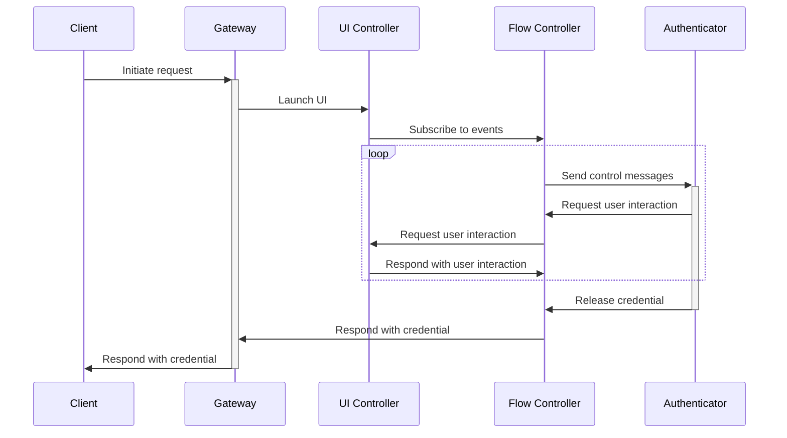

# API Overview

There are three main API defined by this specification:

- [Gateway API](#gateway-api)
- [Flow Control API](#flow-control-api)
- [UI Control API](#ui-control-api)

The **Gateway** is the entrypoint for clients to interact with. The Flow
Controller and UI Controller work together to guide the user through the
process of selecting an appropriate credential based on the request received by
the Gateway.

The **UI Control API** is used to launch a UI for the user to respond to
authenticator requests for user interaction. The **Flow Controller** mediates
authenticator requests for user interaction. The UI Controller and Flow
Controller pass user interaction request and action messages back and forth
until the authenticator releases the credential. Then, the Flow Controller
sends the credential to the Gateway, which relays the credential to the client.

Here is a diagram of the intended usage and interactions between the APIs.



# Revision History

## [unreleased]

### Breaking Changes

- (UI Controller): Renamed `InitiateEventStream()` to `Subscribe()`
- (UI Controller): Serialize enums (including BackgroundEvent, HybridState and UsbState) as (yv) structs instead for a{sv} dicts

### Improvements

- Document errors returned to gateway requests

## [0.1.0] - 2025-08-14

### Breaking Changes

### Improvements

- Initial release.

# Terminology

- _authenticator_: a device that securely stores and releases credentials
- _client_: a user agent requesting credentials for a relying party, for example, browsers or apps
- _credential_: a value that identifies a user to a relying party
- _gateway_: entrypoint for clients
- _privileged_ client: a client that is trusted to set any origin for its requests
- _relying party_: an entity wishing to authenticate a user
- _unprivileged client_: a client that is constrained to use a predetermined set of origin(s)

# General Notes

## Enum values

Generally, enums are serialized as a tag-value structure with a single-byte tag
and a variant as the value (`(yv)`, in D-Bus terms). The documentation for each
specific enum variant describes how to parse the values.

A single null byte (`\0`) is sent for unused enum values.

## D-Bus/JSON serialization

> TODO: rename fields to snake_case so that this note is true in all cases.

This API is modelled after the [Credential Management API][credman-api]. The
top-level fields corresponding to `navigator.credentials.create()` and `get()`
are passed as fields in D-Bus dictionaries using snake_case, according to D-Bus
convention.

So where Credential Management takes:

```json
{
  "origin": "example.com",
  "topOrigin": "example.com",
  "password": true
}
```

this API takes:

```
[a{sv}] {
    origin: Variant(""),
    top_origin: Variant(""), // topOrigin is changed to top_origin
    password: Variant(true),
}
```

However, for the complex requests and responses in the WebAuthn `create()` and `get()`
methods, this API passes JSON-encoded data as a string. Field and enum values
inside the JSON string should remain in camelCase.

Additionally, `ArrayBuffer` objects, which are valid in JavaScript but cannot be
serialized in JSON, must be encoded as base64url strings with padding removed.

So if a client passed this in JavaScript:

```javascript
{
  "origin": "example.com",
  "topOrigin": "example.com",
  "publicKey": {
    "challenge": new Uint8Array([97, 32, 99, 104, 97, 108, 108, 101, 110, 103, 101]),
    "excludeCredentials": [
        {"type:" "public-key", "alg": -7}
    ],
    // ...
  }
}
```

it would pass this request to this API:

```
[a{sv}] {
  origin: Variant(''),
  top_origin: Variant(''),                      // top-level fields topOrigin and publicKey are
  public_key: Variant([a{sv}] {                 // changed to snake_case
    registration_request_json: [s] '{           // <- JSON-encoded string
        "challenge": "YSBjaGFsbGVuZ2U",         // buffer is encoded as base64url without padding
        "excludeCredentials": [                 // "excludeCredentials" is not changed to snake_case
            {"type": "public-key", "alg": -7}   // "public-key" is not changed to snake_case
        ]
        // ...
    }'
  })
}
```

## Window Identifiers

For window identifiers, we follow the same format as the
[XDG Desktop Portal conventions for window identifiers][xdg-window-identifiers].

Where a `parent_window` is specified, the value should be a string in the format:

`<window_system>:<handle>`

The supported window systems are `wayland` and `x11`.

If the client does not have a window or cannot access it, pass an empty string.

[xdg-window-identifiers]: https://flatpak.github.io/xdg-desktop-portal/docs/window-identifiers.html

# Gateway API

The Gateway is the entrypoint for public clients to retrieve and store
credentials and is modeled after the Web
[Credential Management API][credman-api].

It is responsible for authorizing client requests for specific origins and for
validating request parameters, for example, validating the binding between
origins and relying party IDs for public key credential requests.

[credman-api]: https://w3c.github.io/webappsec-credential-management/

## `CreateCredential(credRequest CreateCredentialRequest) -> CreateCredentialResponse`

`CreateCredential()` is the way that new credentials are created. The
`credRequest` parameter defines the client's context as well as the parameters
for what kind of credential the client would like to create.

### Request

```
CreateCredentialRequest(
    IN parent_window s,
    IN options a{sv} {
        origin: string
        is_same_origin: string
        type: CredentialType
        <extra_fields>
    }
)
```

For information on `parent_window`, see [Window Identifiers](#window-identifiers).

> TODO: We should make this a tagged enum

```
CredentialType[s] [
    "publicKey"
]
```

#### Request context

> TODO: replace is_same_origin with topOrigin, required if origin is set.

> TODO: Should we say that `origin` will be optional in the future?

> TODO: Define methods for safe comparison of hosts Punycode origins.

`origin` and `is_same_origin` define the request context. Both are required. A
request is considered to be a cross-origin request if `is_same_origin` is
`false`. For certain credentials, cross-origin requests are not allowed and
will be denied.

At this time, only [web origins][web-origins] with HTTPS schemes are permitted
for the `origin`, for example, `https://example.com`. No Unicode characters or
Punyode are currently permitted.

The origin must be a registrable domain, not a top-level domain nor a public
suffix, as defined by the [Public Suffix List][PSL].

[web-origins]: https://html.spec.whatwg.org/multipage/browsers.html#concept-origin-tuple
[PSL]: https://github.com/publicsuffix/list

#### Credential Types

> TODO: decide on case of strings (snake_case like D-Bus or camelCase like JS?)

Currently, there is only one supported type of `CreateCredentialRequest`,
`CreatePublicKeyCredentialRequest`, identified by `type: "publicKey"` and
corresponds to WebAuthn credentials:

    CreatePublicKeyCredentialRequest[a{sv}] : CreateCredentialRequest {
        origin: string
        is_same_origin: string
        type: "publicKey"
        publicKey: CreatePublicKeyCredentialOptions[a{sv}] {
            // WebAuthn credential attestation JSON
            request_json: String
        }
    }

`request_json` is a string of JSON that corresponds to the WebAuthn
[`PublicKeyCredentialCreationOptions`][def-pubkeycred-creation-options]
type.

### Response

> TODO: Should we group common types in their own section for reference?
> CredentialType will be referenced in the request and response of both create
> and get methods.

`CreateCredentialResponse` is a polymorphic type that depends on the type of
the request sent. Its `type` field is a string specifies what kind of
credential it is, and what `<extra_fields>` should be expected.

```
CreateCredentialResponse[a{sv}] {
    type: CredentialType
    <extra_fields>
}
```

`CredentialType` is defined above.

As the only supported request is `CreatePublicKeyCredentialRequest`, the only
type of response is `CreateCredentialResponse` is `CreatePublicKeyResponse`, also
denoted by `type: "publicKey"`:

    CreatePublicKeyResponse {
        type: "publicKey"
        registration_response_json: String
    }

`registration_response_json` is a JSON string that corresponds to the WebAuthn
[`PublicKeyCredential`][def-pubkeycred] with the `response` field set as an
[`AuthenticatorAttestationResponse`][def-attestation-response].

[def-pubkeycred]: https://www.w3.org/TR/webauthn-3/#publickeycredential
[def-pubkeycred-creation-options]: https://www.w3.org/TR/webauthn-3/#dictdef-publickeycredentialcreationoptions
[def-attestation-response]: https://www.w3.org/TR/webauthn-3/#authenticatorattestationresponse

### Errors

- `AbortError`: Request cancelled by client.
- `SecurityError`: Security policies are not met, for example, requesting an RP credential whose origin does not match.
- `TypeError`: An invalid request is made.
- `NotAllowedError`: catch-all error.

## `GetCredential(credRequest: GetCredentialRequest) -> GetCredentialResponse`

`GetCredential()` is how credentials are retrieved. The `credRequest` parameter
defines the client's context as well as the parameters for what types of
credentials the client will accept.

### Request

```
GetCredentialRequest (
    IN parent_window s
    IN options a{sv} {
        origin: string
        is_same_origin: string
        publicKey: GetPublicKeyCredentialOptions?
    }
)
```

For information on `parent_window`, see [Window Identifiers](#window-identifiers).

Note that while only one credential type can be specified in
`CreateCredential()`, credential types in this `GetCredential()` are not mutually
exclusive: as new credential types are added to the specification, a client may
request multiple different types of credentials at once, and it can expect the
returned credential to be any one of those credential types. Because of that,
there is no `type` field, and credential types are specified using the optional fields.

#### Request Context

The `GetCredential()` `origin` and `is_same_origin` have the same semantics and
restrictions as in `CreateCredential()` described above.

When multiple credential types are specified, the request context applies to
all credentials.

#### Credential Types

> TODO: decide on case of strings (snake_case like D-Bus or camelCase like JS?)

Currently, there is only one supported type of credential, specified by the
`publicKey` field, which corresponds to WebAuthn credentials and takes a
`GetPublicKeyCredentialOptions`:

```
GetPublicKeyCredentialOptions[a{sv}] {
    request_json: string
}
```

`request_json` is a string of JSON that corresponds to the WebAuthn
[`PublicKeyCredentialRequestOptions`][def-pubkeycred-request-options].

[def-pubkeycred-request-options]: https://www.w3.org/TR/webauthn-3/#dictdef-publickeycredentialrequestoptions

### Response

> TODO: Should we group common types in their own section for reference?
> CredentialType will be referenced in the request and response of both create
> and get methods.

`GetCredentialResponse` is a polymorphic type that depends on the type of the
request sent. Its `type` field is a string specifies what kind of credential it
is, and what `<extra_fields>` should be expected.

```
GetCredentialResponse[a{sv}] {
    type: CredentialType
    <extra_fields>
}
```

`CredentialType` is defined above.

As the only supported request is `CreatePublicKeyCredentialRequest`, the only
type of response is CreateCredentialResponse is CreatePublicKeyResponse, also
denoted by `type: "publicKey"`:

    GetPublicKeyCredentialRepsonse {
        type: "publicKey"
        publicKey: {
            // WebAuthn credential assertion response JSON
            authentication_response_json: string
        }
    }

`authentication_response_json` is a JSON string that corresponds to the WebAuthn
[`PublicKeyCredential`][def-pubkeycred] with the `response` field set as an
[`AuthenticatorAssertionResponse`][def-assertion-response].

[def-pubkeycred]: https://www.w3.org/TR/webauthn-3/#publickeycredential
[def-pubkeycred-creation-options]: https://www.w3.org/TR/webauthn-3/#dictdef-publickeycredentialcreationoptions
[def-assertion-response]: https://www.w3.org/TR/webauthn-3/#authenticatorassertionresponse

### Errors

- `AbortError`: Request cancelled by client.
- `SecurityError`: Security policies are not met, for example, requesting an RP credential whose origin does not match.
- `TypeError`: An invalid request is made.
- `NotAllowedError`: catch-all error.

## `GetClientCapabilities() -> GetClientCapabilitiesResponse`

Analogous to WebAuthn Level 3's [`getClientCapabilities()`][def-getClientCapabilities] method.

### Response

`GetClientCapabilitiesResponse` is a set of boolean flags indicating what features this client supports.

    GetClientCapabilitiesResponse[a{sb}] {
        conditional_create: bool,
        conditional_get: bool,
        hybrid_transport: bool,
        passkey_platform_authenticator: bool,
        user_verifying_platform_authenticator: bool,
        related_origins: bool,
        signal_all_accepted_credentials: bool,
        signal_current_user_details: bool,
        signal_unknown_credential: bool,
    }

See the WebAuthn spec for meanings of the [client capability keys][def-client-capabilitities].

[def-client-capabilities]: https://www.w3.org/TR/webauthn-3/#enumdef-clientcapability
[def-getClientCapabilities]: https://w3c.github.io/webauthn/#sctn-getClientCapabilities

# Flow Control API

The Flow Control API is used by the UI to pass user interactions through the
Flow Controller to the authenticator.

## Subscribe()

> TODO: Is a signal here safe? Do we need to have the client set up an
> endpoint to send a unicast message instead? The QR code in hybrid flow contains
> a shared secret, so it would be good to protect that for defense-in-depth.

> TODO: The signature is confusing here: the _client_ implements a signature
> that results in a BackgroundEvent stream, but in reality, the API itself
> requires multiple steps, and this method doesn't return anything at all.

Informs the server that the UI client is ready to receive events from the flow
controller (UI prompts, cancellation notification, etc.).

Immediately after being launched, the UI client should subscribe to
`StateChanged` signals, then call this method to receive events from the flow
controller .

When beginning to handle a request, the server should buffer requests to send
to the UI until it calls this method.

## StateChanged <- BackgroundEvent

Notification of authenticator state change.

```
BackgroundEvent[(yv)] [
    (0x01) UsbStateChanged: UsbState,
    (0x02) HybridStateChanged: HybridState,
]
```

```
UsbState[(yv)] {
    (0x01) "IDLE",
    (0x02) "WAITING" ,
    (0x03) "SELECTING_DEVICE",
    (0x04) "CONNECTED",
    (0x05) "NEEDS_PIN",
    (0x06) "NEEDS_USER_VERIFICATION",
    (0x07) "NEEDS_USER_PRESENCE",
    (0x08) "SELECT_CREDENTIAL",
    (0x09) "COMPLETED",
    (0x0a) "FAILED",
]
```

#### UsbState::IDLE

Not polling for FIDO USB device.

`name`: "IDLE"`

`tag`: `0x01`

`value`: No associated value.

#### UsbState::WAITING

Awaiting FIDO USB device to be plugged in.

`name`: `"WAITING"`

`tag`: `0x02`

`value`: No associated value.

#### UsbState::SELECTING_DEVICE

Multiple USB devices have been detected and are blinking, prompt the user to
tap one to select it.

`name`: `"SELECTING_DEVICE"`

`tag`: `0x02`

`value`: No associated value.

#### UsbState::CONNECTED

USB device connected, prompt user to tap. The device may require additional
user verification, but that might not be known until after the user taps the
device.

`name`: `"CONNECTED"`

`tag`: `0x04`

`value`: No associated value.

#### UsbState::NEEDS_PIN

> TODO: is attempts_left attempts to permanent lockout or until power cycle?
> TODO: Implement cancellation of USB flow

The device needs PIN user verification: prompt the user to enter the pin. Send
the pin to the flow controller using the enter_client_pin() method.

`name`: `"NEEDS_PIN"`

`tag`: `0x05`

`value`: `[i]`, a signed integer indicating the number of PIN attempts remaining
before the device is locked out. If the value is less than 0, the number of attempts
left is unknown.

#### UsbState::NEEDS_USER_VERIFICATION

> TODO: is attempts_left attempts to permanent lockout or until power cycle?

The device needs on-device user verification (likely biometrics, or can be
on-device PIN entry). Prompt the user to interact with the device.

`name`: `"NEEDS_USER_VERIFICATION"`

`tag`: `0x06`

`value`: `[i]`, a signed integer indicating the number of user verification
attempts remaining before the device is locked out. If the value is less than
0, the number of attempts left is unknown.

#### UsbState::NEEDS_USER_PRESENCE

The device needs evidence of user presence (e.g. touch) to release the credential.

`name`: `"NEEDS_USER_PRESENCE"`

`tag`: `0x07`

`value`: No associated value.

#### UsbState::SELECT_CREDENTIAL

> TODO: Change tense of verb to match other states -> SELECTING_CREDENTIAL

> TODO: field names of Credential type are confusing: "name" is an ID, and
> "username" is a name. We should flip them.

Multiple credentials have been found and the user has to select which to use

`name`: `"SELECT_CREDENTIAL"`

`tag`: `0x08`

`value`: `[aa{sv}]`: A list of `Credential` objects.

```
Credential [a{sv}] {
    id: string. An opaque ID referring to the credential on the device.
    name: string. A human-readable identifier for the account.
    username: string. A human-readable name for the account, intended for display. May be empty.
}
```

To prevent CTAP credential IDs leaking to the UI, servers SHOULD make `id` an
opaque value known only to the implementation, for example, by hashing the
actual CTAP credential ID before sending it to the UI.

#### UsbState::COMPLETED

User tapped USB tapped, flow controller has received credential.

`name`: `"COMPLETED"`

`tag`: `0x09`

`value`: No associated value.

#### UsbState::FAILED

> TODO: determine how ServiceError is serialized, force to string?

Interaction with the authenticator failed.

`name`: `"FAILED"`

`tag`: `0x0a`

`value`: `ServiceError`

> TODO: Change serialization of ServiceError

```
ServiceError[?] [
    AUTHENTICATOR_ERROR,
    NO_CREDENTIALS,
    PIN_ATTEMPTS_EXHAUSTED,
    INTERNAL,
]
```

#### ServiceError::AUTHENTICATOR_ERROR

Some unknown error with the authenticator occurred.

`type`: `"AUTHENTICATOR_ERR"`

#### ServiceError::NO_CREDENTIALS

No matching credentials were found on the device.

`type`: `"NO_CREDENTIALS"`

#### ServiceError::PIN_ATTEMPTS_EXHAUSTED,

Too many incorrect PIN attempts, and authenticator must be removed and
reinserted to continue any more PIN attempts.

Note that this is different than exhausting the PIN count that fully
locks out the device.

`type`: `"PIN_ATTEMPTS_EXHAUSTED"`

#### ServiceError::INTERNAL,

Something went wrong with the credential service itself, not the authenticator.

`type`: `"INTERNAL"`

### HybridState

> TODO: Failed has no reason

```
HybridState[(yv)] [
    (0x01) "IDLE",
    (0x02) "STARTED",
    (0x03) "CONNECTING",
    (0x04) "CONNECTED",
    (0x05) "COMPLETED",
    (0x06) "USER_CANCELLED",
    (0x07) "FAILED",
]
```

`HybridState` represents the state of hybrid authenticator flow.

In D-Bus this is represented as a dictionary `[a{sv}]` with two keys `type`,
which is a `HybridStateType`, and `value` whose value depends on
`HybridStateType` and is described below.

#### HybridState::Idle

Default state, not listening for hybrid transport.

`name`: `"IDLE"`

`tag`: `0x04`

`value`: No associated value.

#### HybridState::Started,

QR code flow is starting, awaiting QR code scan and BLE advert from phone.

`name`: `"STARTED"`

`tag`: `0x04`

`value`: `[s]`. String to be encoded as a QR code and displayed to the user to scan.

#### HybridState::Connecting,

BLE advert received, connecting to caBLE tunnel with shared secret.

`name`: `"CONNECTING"`

`tag`: `0x03`

`value`: No associated value

#### HybridState::Connected,

Connected to device via caBLE tunnel, waiting for user to release the
credential from their remote device.

`name`: `"CONNECTED"`

`tag`: `0x04`

`value`: No associated value

#### HybridState::Completed,

Credential received over tunnel.

`name`: `"COMPLETED"`

`tag`: `0x05`

`value`: No associated value

#### HybridState::UserCancelled,

Authenticator operation was cancelled.

`name`: `"USER_CANCELLED"`

`tag`: `0x06`

`value`: No associated value

#### HybridState::Failed,

Failed to receive a credential from the hybrid authenticator.

`name`: `"FAILED"`

`tag`: `0x07`

`value`: No associated value.

## GetAvailablePublicKeyDevices() -> CredentialMetadata[]

> TODO: Should we add displayName and username as optional fields for
> individual credential "devices"

> TODO: I don't like the term "devices" here, since many of these are not what
> you would normally think as devices. Maybe "sources" works better?

> TODO: CredentialMetadata is a bad name here, since this more corresponds to
> the "devices" or "sources" concept. Change to DeviceMetadata?

This retrieves the various "devices" that the user can choose from to fulfill
the request, filtered by the request origin and other request options.

The word "devices" is used broadly and can refer to individual authenticators
(like a locked passkey provider or linked hybrid device), a group of
authenticators on a transport (USB or hybrid QR code devices), or even an
individual credential (in the case of credentials supplied by unlocked passkey
providers).

    CredentialMetadata[a{sv}] {
        id: string,
        transport: Transport
    }

    Transport[s] [
        "ble",
        "hybrid_linked",
        "hybrid_qr",
        "internal",
        "nfc",
        "usb",
    ]

## GetHybridCredential()

Initializes a FIDO hybrid authenticator flow.

### Request

The UI client should subscribe to the `StateChanged` and call `Subscribe()` before calling this method.

### Response

None. Events are sent to `StateChanged` signal.

### Errors

TBD.

## GetUsbCredential()

Initializes a FIDO USB authenticator flow.

### Request

The UI client should subscribe to the `StateChanged` and call `Subscribe()` before calling this method.

### Response

None. Events are sent to `StateChanged` signal.

### Errors

TBD.

## EnterClientPin(pin: [s])

A method to send a client PIN to an authenticator in response to a `UsbState::NEEDS_PIN` event.

### Request

`pin`: Client PIN for the authenticator.

This should be sent in response to a `UsbState::NEEDS_PIN` event. If this
method is sent when the authenticator is not in a state to receive a client
PIN, this PIN will be discarded silently without sending it to the
authenticator.

### Response

None. Response will be sent via a `UsbStateChanged` event in `StateChanged`
signal.

For example, a `UsbState::NEEDS_USER_PRESENCE` will be sent if the PIN was
accepted by the authenticator, or another `UsbState::NEEDS_PIN` event will be
sent if it was incorrect. (Other events may be also sent.)

### Errors

TBD.

## SelectCredential(credential_id: [s])

When multiple credentials are found on a single authenticator, this method
selects which credential to release based on the authenticator.

### Request

`credential_id`: `[s]`. An opaque value referring to the credential chosen by the user.

### Response

None.

### Errors

TBD.

## CancelRequest(request_id: [u])

### Request

`request_id`: `[u]`. A request to cancel the given request ID.

### Response

None.

### Errors

None. If `request_id` is no longer active, the request will be silently
discarded.

# UI Control API

## LaunchUi(request: ViewRequest)

Send request context needed to display a UI to the user for interacting with
authenticators.

This method should be called when a new credential request begins.

### Request

`request`: `ViewRequest`. Request context needed for displaying the UI to the user.

```
ViewRequest: [a{sv}] {
    id: u,
    operation: Operation,
}
```

```
Operation[s] [
    "CREATE",
    "GET",
]
```

### Response

None.

### Errors

TBD.

# Related Works

## Secret Service API

The Secret Service API is allows client applications to store secrets securely
in a service running in the user's login session. Secret data may be stored in
any format that the client application wishes. This makes secrets very flexible,
and applications can use them in many protocols like authentication (passwords,
JWT) or encryption (secure file or messages).

Credentials can be thought of as a subset of secrets that are constrained to a
particular format and protocol in order for users to authenticate to relying
parties interoperably. This way, relying parties do not need to create bespoke
authentication methods, and the user's device can offer a consistent user
interface.

So the Credentials API differs from the Secret Service API in two main ways:

- It supports specific credential formats (e.g. WebAuthn/FIDO2 credentials),
  rather than general secrets.
- It is primarily focused on authenticating to relying parties.
- It encourages interactive authentication and user intent, where Secret Service
  enables silent secret usage.
- It supports communicating with authenticators over several transports, not
  just secure storage.

So the two APIs are independently useful, but can work well together: for
example, an authenticator can be built using the Secret Service API.

## WebAuthn/Web Credential Management API

The Credential API mimics the Web Credential Management API which is used by
WebAuthn. It is the intent for the Credential API to support multiple types of
credentials, like passwords, TOTP, and digital credentials, but at this time
the specification only supports public key/WebAuthn credentials. in tur

The implementation of WebAuthn credentials is heavily inspired by the WebAuthn
API for Android.
